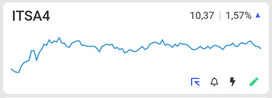

# Desafio Front-End

Esse é o nosso desafio para os candidatos à vaga de front-end no [TradeMap](https://www.linkedin.com/company/trademaphub)

Mesmo que você não esteja em nosso processo seletivo, você pode iniciá-lo resolvendo esse desafio.

# O Desafio

Te daremos alguns requísitos do que a aplicação precisa ter, porém, todos são funcionais. Tudo que envolve estilização e/ou experiência, fica à seu critério.

Esperamos que com isso, obtenhamos respostas diferentes e criativas, afinal, somos diferentes e criativos.

## Requísitos:

- Sua aplicação precisa ser feita em React ou Angular.
- Ela precisa ter duas páginas: **Lista** e **Favoritos**.
    - **Lista**:
        - A página deve ser capaz de listar todos os ativos presentes no arquivo `stocks.json`
        - Cada ativo precisa ter um [gráfico de área](https://chartio.com/learn/charts/area-chart-complete-guide/#:~:text=An%20area%20chart%20combines%20the,like%20in%20a%20bar%20chart.), onde cada ponto equivale a uma entrada do `array` presente na propriedade `chart`.
        - A página deve ser capaz de ordenar os ativos dessa lista por: **Preço** e **Variação**
        - A página deve conter um botão de **favoritar** em cada um dos ativos da lista.
    - **Favoritos**:
        - A página deve ser capaz de listar todos os ativos que foram **favoritados** na página de lista.
        - A página deve ser capaz de ordenar os ativos dessa lista por: **Preço** e **Variação**.
        - Os ativos favoritos devem ser persistidos ao recarregar a página.
- Seu repositório precisa ter instruções de como executá-lo.

## Bonus:

- Utilize variáveis CSS para armazenar as cores utilizadas na estilização da sua aplicação.
- Crie temas para sua aplicação.
- Caso esteja desenvolvendo em React, utilize Redux no controle de estado da aplicação.
- Crie testes unitários para os seus componentes.

## Será um diferencial se você:

- Realizar o deploy da sua aplicação. **Utilizar Docker te garantirá mais pontos.**
- Utilizar apenas componentes criados por você. Não é que não gostamos de Design System, mas queremos testar sua capacidade de criar componentes reutilizáveis.
- Utilizar [commits semânticos](https://www.conventionalcommits.org/pt-br/v1.0.0-beta.4/)

## Como entregar o teste

1. Faça um fork desse repositório.
2. Resolva o desafio da melhor maneira que você puder.
3. Envie um pull-request para análise do resultado.

## Precisa de inspiração?

É assim que apresentamos nossos ativos hoje:

**Obs: não copie essa imagem, apenas a use de inspiração para criar seu próprio componente.**
