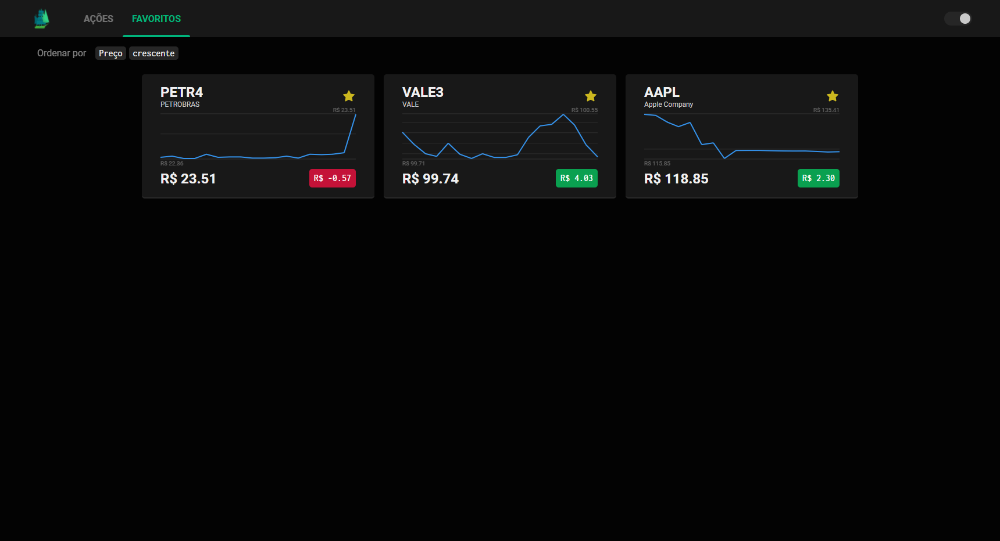

# TradeMap | Desafio Técnico ValeMobi

Esse projeto é fruto do desafio técnico *front-end* da [ValeMobi](https://www.valemobi.com.br/).

## Descrição

A aplicação consiste basicamente em um visualizador de ações do mercado financeiro.


### Favoritos

Ações favoritadas podem ser visualizadas na aba **Favoritos**:



### Ordenamento

É possível ordenar as ações por **preço** e por **variação**, tanto de forma **decrescente** quanto de forma **crescente**:


### Temas & Responsividade

O aplicativo também é capaz de trocar entre os temas **claro** e **escuro**, além de ser **responsivo** para dispositivos *mobile*:


### UI do Gráfico

Ao passar o *mouse* pelo gráfico, um ***popup*** aparece indicando o valor da ação naquele ponto e se foi uma subida ou queda:


<br/>

## Instruções para Executar o Projeto

Faça o *download* do repositório em sua máquina e abra um terminal no escopo do diretório raíz do projeto.

### Usando Yarn

No terminal, rode o seguinte comando:

```...\desafio-frontend> yarn```

Ele irá instalar as dependências do projeto. Após finalizadas todas as instalações, rode:

```...\desafio-frontend> yarn start```

A partir daí, a aplicação poderá ser vista no seu *browser* no [localhost:3000](http://localhost:3000/).

### Usando Docker

Para executar a aplicação pelo Docker, você precisa do [Docker Desktop](https://www.docker.com/products/docker-desktop) instalado na sua máquina e ligado.

Cumpridos os requisitos, rode o comando:

```...\desafio-frontend> docker build -t desafio-frontend .```

O Docker vai criar uma imagem chamada `desafio-frontend` dentro de um *container*. Para ligar esse *container*, rode o seguinte comando:

```...\desafio-frontend> docker run -p 3000:3000 desafio-frontend```

A partir daí, a aplicação poderá ser vista no seu *browser* no [localhost:3000](http://localhost:3000/).

<br/>
<br/>

## Contato

### **Lucas Rezende | Desenvolvedor *Front-end***

 +55 (71) 9 9342-8942

 lucas.s.oliveira.rezende@gmail.com

 [LinkedIn](https://www.linkedin.com/in/lucas-rezende-b155a01b3/)

 [GitHub](https://github.com/oLucasRez)
