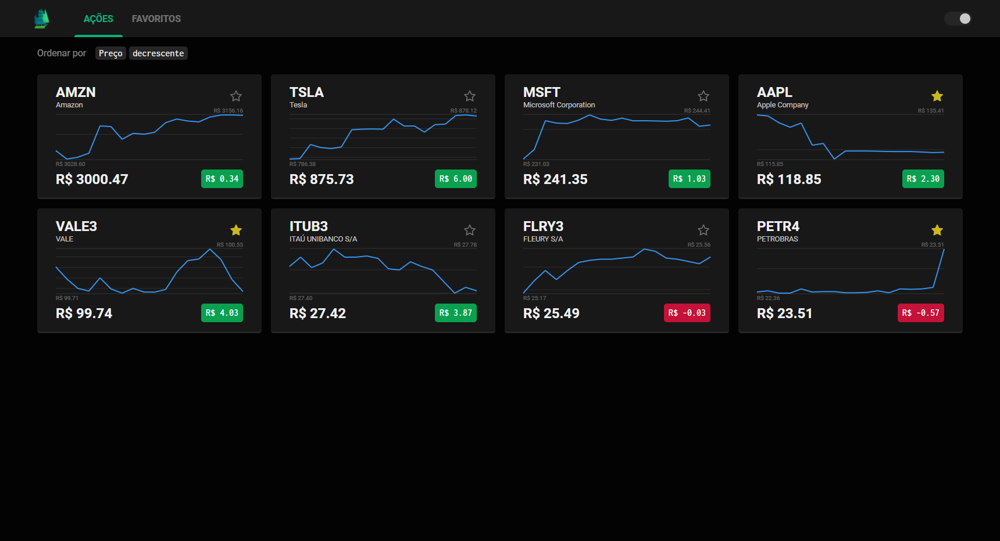

# TradeMap | Desafio Técnico ValeMobi

Esse projeto é fruto do desafio técnico *front-end* da [ValeMobi](https://www.valemobi.com.br/).

## Descrição

A aplicação consiste basicamente em um visualizador de ações, as quais é possível favoritar ou desfavoritar.

## Favoritos

Ações favoritadas podem ser visualizadas na aba **Favoritos**:

## Temas & Responsividade

O aplicativo também é capaz de trocar entre os temas **claro** e **escuro**, além de ser **responsivo** para dispositivos *mobile*:

## UI do Gráfico

Ao passar o *mouse* pelo gráfico, um ***popup*** aparece indicando o valor da ação naquele ponto e se foi uma subida ou queda:

 
 

## Contato

### **Lucas Rezende | Desenvolvedor *Front-end***

 +55 (71) 9 9342-8942

 lucas.s.oliveira.rezende@gmail.com

 [LinkedIn](https://www.linkedin.com/in/lucas-rezende-b155a01b3/)

 [GitHub](https://github.com/oLucasRez)